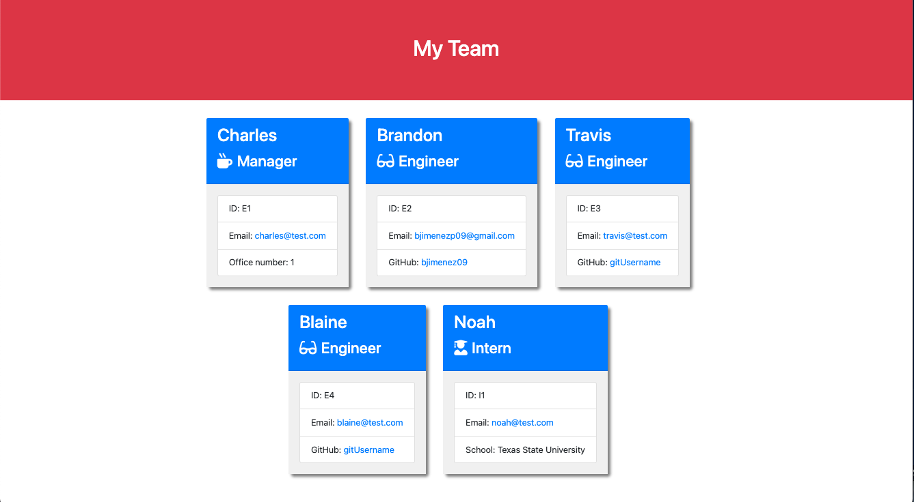

# Team-Profile-Generator
## Description

The focus of this unit was Object Oriented Programming. I was tasked to build a Node.js command-line application that takes in information about employees on a software engineering team, and with that information it generates an HTML webpage that displays the user input data. Part of the application were to create employee objects usings classes. Among them were the Manager, Engineer, and Intern classes. A demonstration of the node application and the testing is shown below.

## Table of Contents

- [User Story](#user-story)
- [Acceptance Criteria](#acceptance-criteria)
- [Installation](#installation)
- [Usage](#usage)
- [Walkthrough Video](#walkthrough-video)
- [Screenshot](#screenshot)
- [Credits](#credits)
- [License](#license)

## User Story

```md
AS A manager
I WANT to generate a webpage that displays my team's basic info
SO THAT I have quick access to their emails and GitHub profiles
```

## Acceptance Criteria

```md
GIVEN a command-line application that accepts user input
WHEN I am prompted for my team members and their information
THEN an HTML file is generated that displays a nicely formatted team roster based on user input
WHEN I click on an email address in the HTML
THEN my default email program opens and populates the TO field of the email with the address
WHEN I click on the GitHub username
THEN that GitHub profile opens in a new tab
WHEN I start the application
THEN I am prompted to enter the team manager’s name, employee ID, email address, and office number
WHEN I enter the team manager’s name, employee ID, email address, and office number
THEN I am presented with a menu with the option to add an engineer or an intern or to finish building my team
WHEN I select the engineer option
THEN I am prompted to enter the engineer’s name, ID, email, and GitHub username, and I am taken back to the menu
WHEN I select the intern option
THEN I am prompted to enter the intern’s name, ID, email, and school, and I am taken back to the menu
WHEN I decide to finish building my team
THEN I exit the application, and the HTML is generated
```

## Installation

To Install:

Install node.js 

Clone the repository from GitHub (https://github.com/bjimenez09/Team-Profile-Generator).

Run these command lines in your terminal to install necessary dependencies:

```
npm init -y
npm install
```

Run this command line in your terminal to install inquirer:

```
npm i inquirer@8.2.4
```

## Usage

Direct your terminal to the /Develop directory and run this command line to initiate application:

```
node index.js
```

## Walkthrough Video


## Screenshot
This is a screenshot of the generated HTML webpage.



## Badges


## Credits
- Bootstrap: https://getbootstrap.com/
- NodeJS: https://nodejs.org/en/
- Jest: https://www.npmjs.com/package/jest
- Inquirer: https://www.npmjs.com/package/inquirer

## License